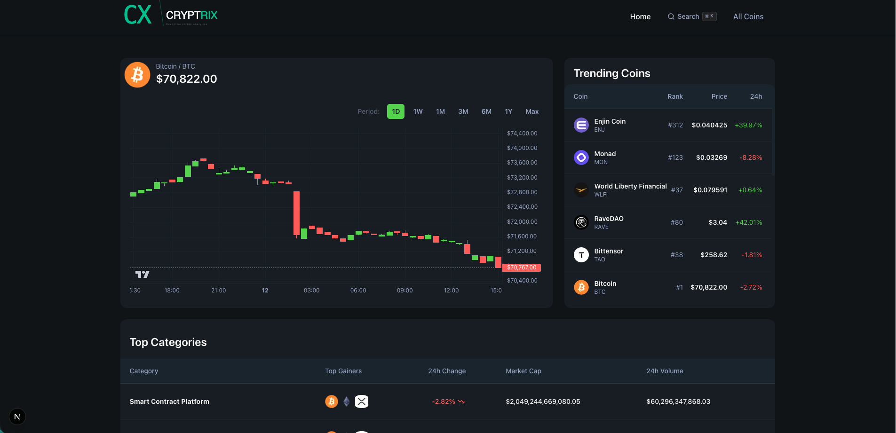
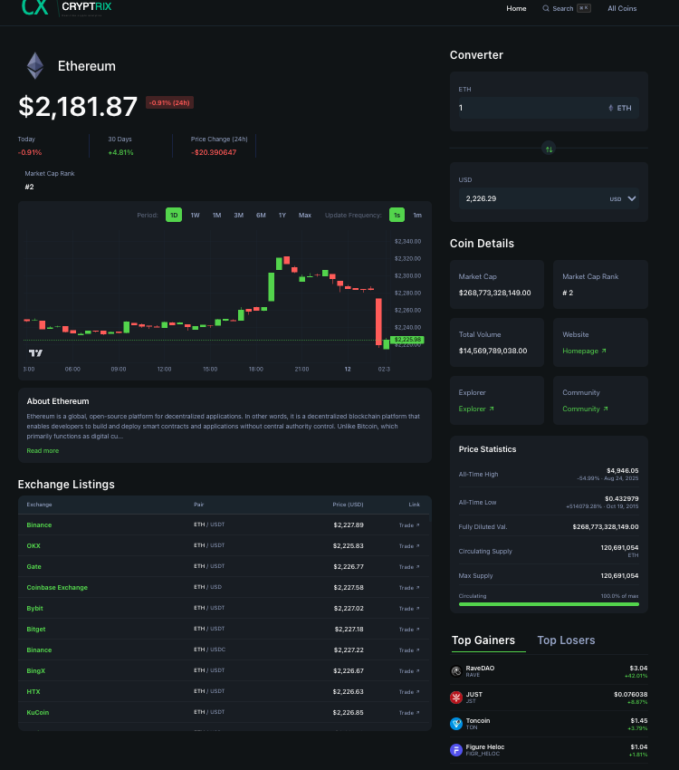
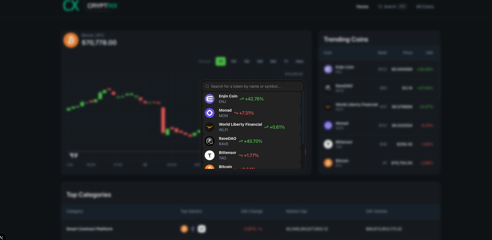

# Cryptrix

A professional, real-time cryptocurrency dashboard and market terminal built with **Next.js 16 (App Router)**, **TypeScript**, **Tailwind CSS v4**, and **shadcn/ui** — powered by the CoinGecko and GeckoTerminal APIs.

---

## Key Highlights

- **Next.js 16 App Router** with Server Components, Server Actions, and Suspense streaming — zero client-side API keys, minimal JavaScript shipped to the browser
- **Live price polling** every 15 seconds via server actions (no stale snapshots, no WebSocket dependency)
- **Interactive candlestick charts** built with `lightweight-charts` v5, supporting 1D / 1W / 1M / 3M / 6M / 1Y / Max period switching
- **Command-palette search** (Cmd+K) powered by `cmdk`, `swr`, and a two-step `/search` + `/coins/markets` merge for fast, always-fresh results
- **Two-column responsive coin detail terminal** — chart, live header, exchange listings, converter, price stats, and top movers
- Fully typed with TypeScript, linted with ESLint flat config + Prettier, styled with Tailwind v4 and shadcn primitives

---

## Summary

Cryptrix is a crypto market dashboard that delivers live prices, interactive charts, and a full trading-terminal-style coin detail page — without relying on WebSockets, paid API tiers, or a backend database. Every page is rendered on the server with Suspense-based streaming, while targeted client components handle only what needs interactivity: charts, search, polling, and tabs.

---

## Why This Project Matters

Most crypto dashboards either ship bloated client bundles with API keys exposed in the browser, or they rely on expensive WebSocket tiers and heavy state management. Cryptrix takes a different approach:

- **Server-first architecture** — data fetching happens on the server via Server Actions, so the browser never sees the API key and the initial payload is already fully rendered
- **Smart polling in place of WebSockets** — the CoinGecko Demo API doesn't support WebSockets, so live price updates are handled by lightweight 15-second server polls with `cache: 'no-store'`
- **Data consistency across the app** — trending prices in the navbar, home page, and detail page all pull from the same `/simple/price` endpoint, so users never see two different BTC prices side by side
- **Real UX polish** — sticky footer, internal-scroll exchange table, debounced search, Suspense skeletons, and responsive two-column layouts

It's a project designed to prove mastery of modern React patterns, not just to display numbers.

---

## Features

### Home Dashboard
- **Bitcoin Overview** with interactive candlestick chart and period switching (1D / 1W / 1M / 3M / 6M / 1Y / Max)
- **Trending Coins** table with live prices merged from `/simple/price` to avoid stale snapshots
- **Top Categories** with market cap, volume, and 24h change
- Suspense-based streaming with custom skeleton fallbacks for each section

### Coin Detail Page (`/coins/[id]`)
- **Two-column responsive layout**: chart + live data on the left, stats and tools on the right
- **Live-updating CoinHeader** — polls `/simple/price` every 15 seconds for the current coin
- **Candlestick chart** via `lightweight-charts` v5 with configurable periods and update intervals
- **About section** with HTML-stripped descriptions and Read more / Show less toggle
- **Exchange Listings** with sticky header, internal scroll, and `table-fixed` layout so all 4 columns (Exchange, Pair, Price, Link) always fit
- **Currency Converter** supporting USD, EUR, GBP, JPY, BTC, ETH
- **Coin Details** grid: market cap, rank, volume, website, explorer, community links
- **Price Statistics**: ATH, ATL, fully diluted valuation, circulating / max supply with progress bar
- **Top Gainers & Losers** with tab switching (server-fetched, client-rendered)

### All Coins Page (`/coins`)
- Paginated table (20 coins/page) with rank, name, price, 24h change, market cap
- Custom pagination with ellipsis logic and URL-driven page state

### Global Search (Cmd+K)
- Command palette powered by `cmdk` (shadcn Command component)
- **Debounced search** (300ms) using `react-use` to stay within API rate limits
- **Two-step data merge** — `/search` for matching coins, then `/coins/markets` for fresh prices
- Shows **trending coins** when idle, **live search results** while typing
- **SWR** caching prevents redundant fetches and handles race conditions
- Keyboard shortcut: `Cmd+K` (Mac) / `Ctrl+K` (Windows)

### Live Price Updates
- Server action polls CoinGecko's `/simple/price` endpoint every 15 seconds
- Updates the CoinHeader in real time without a page refresh
- `cache: 'no-store'` on every request guarantees fresh data

---

## Tech Stack

| Layer | Technology |
|---|---|
| Framework | Next.js 16.2.3 (App Router) |
| Language | TypeScript |
| UI | React 19, shadcn/ui (Table, Pagination, Command, Dialog, Tabs) |
| Styling | Tailwind CSS v4, CSS nesting |
| Charts | lightweight-charts v5 |
| Data Fetching | Server Actions (`'use server'`), SWR, Suspense streaming |
| Search | cmdk, react-use (debounce + keyboard shortcuts) |
| APIs | CoinGecko REST API (Demo), GeckoTerminal API |
| Tooling | ESLint (flat config), Prettier |

---

## How It Works

### Server / Client Component Split
- **Server Components** handle all data fetching. There are no `useEffect` fetch watchers, and no API keys ever reach the browser.
- **Client Components** (`'use client'`) are used only where interactivity is required — charts, the search modal, tab switching, live polling, and the converter.
- Server Actions defined in `lib/coingecko.actions.ts` are imported directly into client components — no API routes, no client fetch wrappers.

### Data Consistency
- Trending coins in the navbar and the home page both pull live prices from `/simple/price`, rather than using the stale snapshot embedded in `/search/trending`.
- The live price on the coin detail page uses the same `/simple/price` endpoint, so the header, chart, and exchange rows stay in sync.

### Layout Patterns
- `flex flex-col min-h-full` on `<body>` with `mt-auto` on the footer for sticky-bottom behavior without absolute positioning
- `table-fixed` with explicit percentage column widths on Exchange Listings to prevent content overflow
- `max-h` + `overflow-y-auto` for internal scroll on long data tables
- Suspense boundaries with custom skeleton fallbacks for every async section

---

## Project Structure

```
app/
  layout.tsx            # Root layout (Header + Footer on every page)
  page.tsx              # Home: CoinOverview + TrendingCoins + Categories
  coins/
    page.tsx            # All Coins with pagination
    [id]/page.tsx       # Coin detail page
  terms/page.tsx        # Terms & Conditions

components/ui/
  Header.tsx            # Navbar with logo + search modal + nav links
  Footer.tsx            # Global footer with copyright + links
  SearchModal.tsx       # Cmd+K search with SWR + debounce
  CandleSticksChart.tsx # lightweight-charts candlestick with period switching
  LiveDataWrapper.tsx   # Client wrapper: live price polling + chart + about + exchanges
  CoinHeader.tsx        # Coin name, live price, change stats
  CoinDescription.tsx   # About section with HTML stripping + expand/collapse
  ExchangeListings.tsx  # Ticker table with sticky header + internal scroll
  Converter.tsx         # Currency converter
  PriceStats.tsx        # ATH, ATL, supply stats
  TopMovers.tsx         # Gainers/losers tab UI (client)
  TopMoversWrapper.tsx  # Server data fetch for top movers
  DataTable.tsx         # Generic reusable table component
  CoinsPagination.tsx   # Pagination with page numbers + ellipsis
  home/
    CoinOverview.tsx    # Bitcoin chart + price header
    TrendingCoins.tsx   # Trending coins table with live prices
    Categories.tsx      # Market categories table

lib/
  coingecko.actions.ts  # Server actions: fetcher, searchCoins, getLivePrice, getPools
  utils.ts              # formatCurrency, formatPrice, formatPercentage, cn, etc.

constants.ts            # Chart config, period buttons, interval buttons
type.d.ts               # Global TypeScript interfaces
```

---

## Screenshots

### Home Dashboard


### Coin Detail Page


### Global Search (Cmd+K)


---

## Installation and Setup

### Prerequisites
- Node.js 18+
- A free CoinGecko **Demo API key** — sign up at [coingecko.com/en/api](https://www.coingecko.com/en/api)

### Clone and install

```bash
git clone https://github.com/yourusername/cryptrix.git
cd cryptrix
npm install
```

### Environment variables

Create a `.env.local` file in the project root:

```env
COINGECKO_BASE_URL=https://api.coingecko.com/api/v3
COINGECKO_API_KEY=your_demo_api_key_here
```

### Run the dev server

```bash
npm run dev
```

Then open [http://localhost:3000](http://localhost:3000).

---

## Usage

- **Browse the home dashboard** to see the Bitcoin candlestick chart, trending coins, and top categories at a glance.
- **Click any coin** from trending, categories, or the full coins list to open its detail page.
- **Switch chart periods** (1D / 1W / 1M / 3M / 6M / 1Y / Max) on both the home overview and coin detail pages.
- **Press `Cmd+K`** (Mac) or `Ctrl+K` (Windows) to open the global search palette and jump to any coin.
- **Use the converter** on the coin detail page to convert between USD, EUR, GBP, JPY, BTC, and ETH.
- **Paginate** through the full coin market on `/coins` — 20 rows per page, URL-driven.

---

## Future Improvements

- **Portfolio tracking** — let users save a watchlist locally (via `localStorage`) and see aggregated performance
- **Price alerts** — browser-native notifications when a selected coin crosses a threshold
- **Expanded chart indicators** — moving averages, RSI, and volume overlays on the candlestick chart
- **Multi-currency global toggle** — switch the whole app between USD, EUR, GBP, and more
- **Pro API upgrade path** — swap polling for true WebSocket streams once a Pro key is available (the scaffolding already exists in `hooks/useCoinGeckoWebSocket.ts`)
- **i18n** — localize labels and number formats for non-English users

---

## Why This Project Stands Out

- **Modern Next.js done right** — Server Components, Server Actions, and Suspense are used intentionally, not as buzzwords
- **No API key leakage** — every external call happens on the server, so the browser bundle contains zero secrets
- **Production-grade UX details** — debounced search, race-condition-safe SWR caching, sticky table headers, sticky footer, responsive two-column layouts, and consistent prices across every surface
- **Thoughtful performance** — streaming Suspense boundaries mean the user sees meaningful content as soon as the server can produce it, instead of waiting for one big waterfall
- **No dead code or fabricated features** — everything documented here is implemented and working in the repo

---

## Author

**Prashan Adhikari**

- Email: [prashanadhikari2486@gmail.com](mailto:prashanadhikari2486@gmail.com)
- LinkedIn: [linkedin.com/in/prashan-adhikari-902915242](https://www.linkedin.com/in/prashan-adhikari-902915242/)

---

## Appendix

### Short GitHub repo description (for the repo sidebar)

> A real-time cryptocurrency dashboard built with Next.js 16, TypeScript, Tailwind v4, and shadcn/ui — live prices, candlestick charts, and a Cmd+K search terminal powered by CoinGecko.

### Resume-ready project description (2–3 lines)

> Built Cryptrix, a production-grade cryptocurrency dashboard with Next.js 16 (App Router), TypeScript, Tailwind CSS v4, and shadcn/ui, featuring live-polled prices, interactive `lightweight-charts` candlesticks, and a Cmd+K command palette with SWR-cached, debounced search. Designed server-first with Server Actions and Suspense streaming — no client-side API keys, no WebSocket dependency, and fully consistent pricing across every surface of the app.
